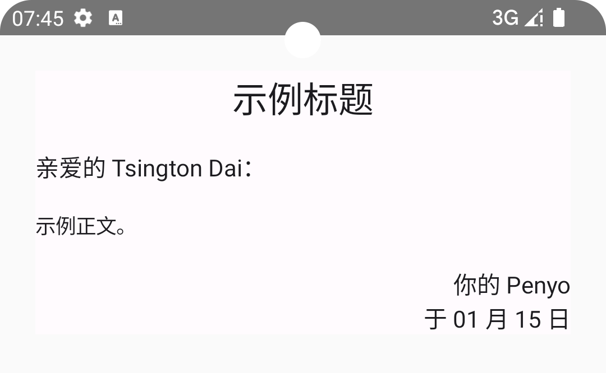
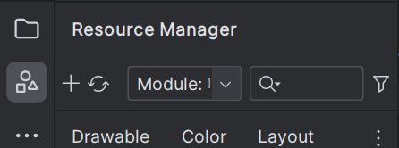
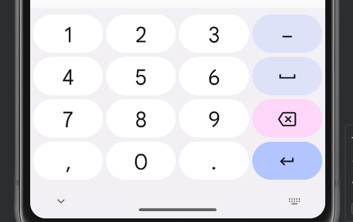

# Compose 基础

:::tip
接下来假设您是一位精通 [Vue](../node-js/vue-101.md) 和 [TS](../js-and-ts/ts-101.md) 特性的专家，一些共通的基本概念不予列出。
:::

Compose 通常指的是 Jetpack Compose。Jetpack 是一系列的现代 Android 库的组合。利用它们，我们能够更高效的开发应用程序。

Compose 是现代 Android 应用程序界面的基础设施，它提供了响应式的数据组件，使得我们不再需要关心 Model 和 View 不同步的问题——所以现在就像 Vue 一样。

## 组件

任何函数一旦被打上 `@Composable` 的注解，则表示该函数是对组件（Component）的描述，它不会返回任何值：

```kt
@Composable
// 由于组件的性质（并不是行为的集合），其命名采用大驼峰法
fun Welcome(username: String) {
  val now = when (Calendar.getInstance().get(Calendar.HOUR_OF_DAY)) {
    in 4..8 -> "早上"
    in 8..11 -> "上午"
    in 11..14 -> "中午"
    in 14..17 -> "下午"
    in 17..21 -> "晚上"
    else -> "深夜"
  }
  Text(text = "$username，${now}好！")
}
```

组件是可被复用的，因此在 `onCreate()` 里我们只用关心组建的拼装即可。组件的细节被解耦到各个可组合函数里去了。

```kt
// 主活动，继承自 ComponentActivity 类
class MainActivity : ComponentActivity() {
  // 重写了 onCreate() 方法
  override fun onCreate(savedInstanceState: Bundle?) {
    super.onCreate(savedInstanceState)
    // 组件全部放到 setContent 里
    setContent {
      Welcome("比亚迪")
      AnotherComponent1()
      AnotherComponent2()
      AnotherComponent3()
    }
  }
}
```

如果你想孤立地查看组件的样式（而不是查看它与其他组件共存的样式），则可使用注解 `@Preview`：

```kt
@Preview
@Composable
fun Welcome(username: String) {
  // 省略
}
```

这样可在 Android Studio 里编译只含这一个组件的 App Demo。

## 组件容器

与 Vue 不同，Compose 里的组件其实并不能孤立存在，而是必须处于**容器**中。没有显式指定时，任何组件都在 `Box` 里：

```kt
// 组件容器是一种特殊的组件，因此它也是一个函数
// 若没有参数，就可以不写标记参数列的括号对 ()
Box {
  Text("原神玩家怎么你了，我们原神玩家就是这个样子的！")
}
```

如果你希望组件有那么一点不一样，则可以使用其它带样式干扰的容器，如 `Surface`，它能够提供改变背景色的能力：

```kt
// 就像 background-color: red 一样
Surface(color = Color.Red) {
  Text("原神玩家“红”温了！")
}
```

:::tip
`color` 挂载在 `Surface` 和 `Text` 上的效果是一样的吗？
:::

或者你可能想要增加一些内边距：

```kt
// Modifier 用于扩充或修饰可组合项
Surface(modifier = Modifier.padding(24.dp)) {
  Text("宽敞多了！")
}
```

:::tip
任何容器/组件都可以挂载 `modifier` 节点。且 `Modifier` 支持链式调用。
:::

为了使你自己的组件也能被修饰，应该总在参数列中加入**可选**的 `modifier`：

```kt
fun YourComponent(
  innerText: String,
  /* 告诉 IDE 这个属性是修饰器，可选标注 */
  @SuppressLint("ModifierParameter") modifier: Modifier = Modifier
) {
  // 省略
}
```

## 文本组件

文本组件 `Text` 用于容纳文字，以及承担样式化文本的任务。

```kt
Text(
  text = "你想要写点什么呢？"
  /* sp 是可缩放像素，与当前系统字体大小有关，常常应用于字体 */
  fontSize = 100.sp
  /* dp 是密度无关像素，常常应用于非字体。这里为了展示用了 dp，但实际上应该使用 sp */
  lineHeight = 120.dp
  /* 字色 */
  color = Color.Blue
)
```

`Text` 不止这些属性。你可以在开发中查看其参数列来了解更多，配合修饰器（modifier）对本身尺寸、边距等的修改，能够做出堪比 Web 中 `<p>` 的各种效果。

:::info
在案例中，`sp` 和 `dp` 都是 `Int` 的扩展属性（即它们都是 `Int` 扩展标准的成员）。相应的，其它数值类型也有这些扩展属性。
:::

## 箱、行、列容器

前面已经提到，未显式指定容器时，组件总在 `Box` 里。

`Box` 能够令其中的全部元素堆叠在一起，有点像 CSS 里所有元素都使用绝对定位。渲染顺序遵循先来后到的原则，因此常令图片排布在文字前，两者共用一个 `Box`。

为了更好地排列元素，现在引入类似 `flex` 布局的 `Row` 和 `Column` 容器。

处于 `Row` 中的元素将从左到右横向排列：

```mermaid
graph LR
  subgraph Row
    C1["Component"]
    C2["Component"]
    C3["Component"]
  end
```

处于 `Column` 中的元素将从上到下纵向排列：

```mermaid
graph TB
  subgraph Column
    C1["Component"]
    C2["Component"]
    C3["Component"]
  end
```

比如我想要制作一个信件的模板：

```kt
@Composable
fun Letter(
  /* 像不像 Vue 里的 slot */
  to: String = "Tsington Dai",
  from: String = "Penyo",
  title: String = "示例标题",
  body: String = "示例正文。",
  modifier: Modifier = Modifier
) {
  // flex-direction: column
  Column {
    Text(
      text = title,
      textAlign = TextAlign.Center,
      /* 标题，就是要 big！ */
      fontSize = 24.sp,
      /* 将该组件宽度设为与视图等宽，否则居中不能生效 */
      modifier = Modifier
        .padding(0.dp, 0.dp, 0.dp, 18.dp)
        .fillMaxWidth()
    )
    Text(text = "亲爱的 ${to}：", fontSize = 16.sp)
    Text(text = body, modifier = Modifier.padding(0.dp, 18.dp))
    val now = LocalDateTime.now().format(DateTimeFormatter.ofPattern("MM 月 dd 日"))
    Text(
      text = "你的 $from\n于 $now",
      textAlign = TextAlign.Right,
      fontSize = 16.sp,
      /* 居右和居中同理，需要使其变成类似 div 的存在。否则是行内元素，不生效 */
      modifier = Modifier.fillMaxWidth()
    )
  }
}
```

效果：



如果行列里有多个元素，则需要考虑具体的排布方式——通过行容器的 `horizontalAlignment` 或列容器的 `verticalArrangement` 确定：


## 图片组件

有时候文字可能不足以表达复杂信息，因而需要展示图片。

1. 在 Android Studio 侧边栏中寻找 Resource Manager



2. 添加，选中 Import Drawables


3. 指定文件名为 ID（这是后续调用其的唯一根据，越简单越好），选择类型限定为 _Density_，值为 _No Density_


:::tip
Android Studio 默认总将**图标**处理为适配不同 ppi 设备的副本，但对于较大的**图片**来说，其实并无必要。因此采用 No Density。
:::

:::tip
Android Studio 会自动追踪导入的资源文件，并实时编译 `R` 类。资源在此时是它的成员，名称由你先前指定的为准。如你导入了一张 _hello.png_ 且遵守默认配置，则在调用时写为：

```kt
R.drawable.hello
```

按照规范，资源应该采取全部小写、空格为下划线的命名方式。
:::

4. 调用 `Image`（androidx.compose.foundation.Image）组件

```kt
// 将资源路径转化为 Painter 实例
val painter = painterResource(R.drawable.mountain)
// 由 Image 载入资源，描述为空
Image(painter, null)
```

:::tip
一般图片渲染后会以最大尺寸展示全部内容，你可能会希望它硬填充宽度或高度（或全屏显示/挤压全屏显示等），可指定 `contentScale` 属性。

调节透明度可指定 `alpha` 属性，它接收一个 `Float` 值（因而值末尾必须添加 _F_ 标识）。

其它更多属性请读者自行学习。
:::

## 国际化

你的应用程序也许不止为了你自己国家的人设计，因此需要考虑你的应用程序翻译到其它语言的问题。

若一切与语言挂钩的文本都能被解耦到一个单独的文件里，这对于翻译会简单很多，因此原先这样的代码：

```kt
Text("娇宝，我真的好喜欢你啊！为了你，我要学 Android 应用开发！")
```

（通过 Extract string resource 功能）可以变为：

```kt
// getString() 可以解析字符串资源
Text(getString(R.string.slogan))
```

但这不是响应式的，因此你最好手动改为：

```kt
// stringResource() 可以解析字符串资源
Text(stringResource(R.string.slogan))
```

而真正的字符串被放在 _res/values/strings.xml_ 里：

```xml
<resources>
  <string name="slogan">娇宝，我真的好喜欢你啊！为了你，我要学 Android 应用开发！</string>
</resources>
```

字符串是动态的也没关系：

```kt
Text("您一共花费了${cost}元")

Text(stringResource(R.string.cost_tip, cost))
```

```xml
<string name="cost_tip">您一共花费了%s元</string>
```

## 响应式变量

**响应式变量**可以使 Compose 自动追踪变量值的更新并同步到视图里：

```kt
var dynamicVar by remember { mutableStateOf(114514) }
```

本质是将变量值[委托](./kotlin-101.md#委托模式)给 `remember`，并根据回调函数 `muteableStateOf()` 获得一个与变量性质一致的可操作对象。

`remember` 可以将变量放入堆内存中（不受组件生命周期影响），而 `muteableStateOf()` 可以返回一个观察者对象（类似**钩子**）。

但如果你旋转屏幕，或发生任何配置更改或者进程终止时，整个 activity 会重启，所有状态都将丢失。

这时可以使用 `rememberSaveable`，而不使用 `remember`。这会保存每个在配置更改（如旋转）和进程终止后保留下来的状态。

```kt
var dynamicVar by rememberSaveable { mutableStateOf(114514) }
```

## 按钮组件与开关组件

静态页面只能展示有限的信息，一个有意义的应用程序应该具备用户输入功能。

**按钮**是最简单的交互式控件：

```kt
// 事件驱动
Button(onClick = { /* operation */ }) {
  Text("点我！")
}
```

**开关**也算一种按钮，但是能在视图中携带二极状态：

```kt
var isOn by remember { mutableStateOf(false) }
Switch(
  checked = isOn,
  onCheckedChange = { /* operation */ }
)
```

## 输入框组件

`TextField` 可以充当输入框：

```kt
// 定义响应式变量
var name by remember { mutableStateOf("") }

TextField(
  /* 内部所呈现的值 */
  value = name,
  /* 变化监听 */
  onValueChange = { name = it },
  /* 类似于 placeholder */
  label = { Text("姓名") }
  /* 前置图标，可以使输入框目的更明确 */
  leadingIcon = { Icon(painterResource(R.drawable.your_icon), null) }
)
```

:::warning
你必须使输入框的 ViewModel 值是一个可响应变量，否则 View 值不能被正确地刷新！
:::

你可能希望虚拟键盘应对指定文本框时能够锁定数据类型，比如说纯数字：

```kt
var rate by remember { mutableStateOf("") }
TextField(
  value = rate,
  onValueChange = { rate = it },
  label = { Text("费率") },
  leadingIcon = { Icon(painterResource(R.drawable.money), null) },
  /* 锁定键盘类型为数字键盘 */
  keyboardOptions = KeyboardOptions(keyboardType = KeyboardType.Number)
)
```

:::tip
其实这并不能真的限制文本框内只输入数字，只是不能通过当前虚拟键盘输入非数字罢了。

要实现文本框内只能输入数字，可以在 `onValueChange` 里加入输入验证，如每次更新都检查字符串能否转化为数字。能转化才把新的值赋给变量。
:::

你可能会注意到，键盘右下角的快捷操作键默认都是**回车**。但我们习惯右下角是“下一个”或“提交”。



这是可以更改的，通过修改 `keyboardOptions`：

```kt
keyboardOptions = KeyboardOptions(
  /* 键盘类型 */
  keyboardType = KeyboardType.Number,
  /* 快捷键类型。可选 Search、Send、Go、Next、Done */
  imeAction = ImeAction.Next
)
```
