# 数据通信基础

## 基本概念

**数据通信系统**由**信源、发送器、信道、接收器和信宿**构成。其中，信源和发送器合称为**源系统**，接收器和信宿合称为**目的系统**。信道会受到**噪声**（或其他类型的干扰源）的**干扰**。

- 源系统
  - 源点：源点设备产生通信网络要传输的数据。
  - 发送器：通常源点生成的数据要通过发送器编码后才能够在传输系统中进行传输。
- 目的系统
  - 接收器：接收传输系统传送过来的信号，并将其转换为能够被目的设备处理的信息。
  - 终点：终点设备从接收器获取传送来的信息。
- 传输系统

数据通信的基本过程分为五个阶段，包含两项内容：

- 建立物理连接
- 建立逻辑连接（握手）
- **数据传输**
- 断开逻辑连接（握手）
- 断开物理连接
  _并不是所有的数据通信都需要全部5个阶段。_

接下来来了解一些专业名词：

- 数据（Data）
  - 传递（携带）信息的实体。数据是定义为有意义的实体，是表征事物的形式；如文字、声音和图像等。
- 信息（Information）
  - 数据的内容或解释。
- 信号（Signal）
  - 数据的物理量编码（通常为电编码）。数据以信号的形式在介质中传播。
- 模拟信号
  - **时间上连续**，包含无穷多个信号值。
- 数字信号
  - **时间上离散**，仅包含有限数目的信号值。最常见的是二值信号。
- 周期信号
  - 信号由不断重复的固定模式组成（如正弦波）。
- 非周期信号
  - 信号没有固定的模式和波形循环（如语音的音波信号）。
- 信道（Channel）
  - 传送信息的线路（或通路）。
- 数字信道
  - 以**数字脉冲形式**（离散信号）传输数据的信道。计算机网络中主要采用数字信道进行数据传输，如ADSL、ISDN、DDN、ATM、局域网等。
- 模拟信道
  - 以**连续模拟信号形式**传输数据的信道。如CATV、无线电广播、电话拨号线路等。
- 信道带宽
  - 指信道中传输的信号在不失真的情况下所占用的频率范围，单位用**赫兹**（Hz）表示。通常，带宽越大，信道容量越大，数据传输速率越高。
- 信道容量
  - 一个数字通信系统最大的信息速率，即单位时间可能传送的最大比特数，它代表一个信道传输数字信号的能力，单位为bit/s。
- 信号带宽
  - 信号变化的变动范围。
- 线路带宽
  - 线路传输最大速率。
- 信息编码
  - 将信息用二进制数表示的方法。例如：ASCII编码、BCD编码等。
- 数据编码
  - 将数据用物理量表示的方法。例如字符“A”的编码为*01000001*，其数据编码可为：。

信息通过数据通信系统进行传输，但**信息不能直接在信道上传输**，而是需要经过以下四个步骤：

1. 编码（信息转为二进制数据、二进制数据转为信号）：数据→适合传输的数字信号——便于同步、识别、纠错
2. 调制（信号发射到信道）：数字信号→适合传输的形式——按频率、幅度、相位
3. 解调：接收波形→数字信号
4. 解码：数字信号→原始数据

编码：数据到信号的转换办法如下表：
|从\到|模拟信号|数字信号|
|-|-|-|
|**模拟数据**|移频、调制|PCM编码|
|**数字数据**|调制|数字编码|

- 数字通信
  - 在数字信道上实现模拟信息或数字信息的传输。其具有抗噪声（干扰）能力强；可以控制差错，提高了传输质量；便于用计算机进行处理；易于加密、保密性强；可以传输语音、数据、影像，通用、灵活等优点。
- 模拟通信
  - 在模拟信道上实现模拟信息或数字信息的传输。

计算机通信**仅在不得已的情况下，才会采用模拟通信**，如通过电话线拨号上网。

描述数据传输速率的大小和传输质量的好坏，往往需要运用**比特率、波特率、出错率和信道容量**等技术指标。

- 数据传输率 $C$
  - 数据传输率又称**比特率**，是一种数字信号的传输速率，它表示单位时间内所传送的二进制代码的有效**位**（bit）数，单位用**比特/每秒**（b/s）表示。
- 波特率 $B$
  - 波特率是一种调制速率，也称**波形速率或码元速率**。是数字数据经编码后的传输信号在信道上的传输速率；指每秒传输的码元数，单位为**波特**（baud）。

一般情况下，如果码元状态数为 $M$（$M$ 为2的整数次幂），则 $C$ 和 $B$ 的关系为：$C=B\log_2M$（b/s）。

> 例：NRZ编码一个码元表示一个比特的信息，因此 $C=B$；四进制码有4种码元状态（00、01、10、11），每个码元带2比特数据，所以 $C=2B$。

二进制比特在数据传输系统中被传错的概率，它在数值上近似等于：

$$
P_e = \dfrac{N_e}N
$$

其中，$N$ 为传输的二进制比特总数，$N_e$ 为被传错的比特数。

**奈奎斯特准则**：在一个通信信道带宽为 $W$（**单位赫兹**）的无噪声低通信道上，最高的码元传输速率 $B_{max}$ 为 $2W$ 即 $B_{max} = 2W（baud）$；最大数据传输速率 $C_{max} = 2W·\log_2M\ (b/s)$。

**香农定理**：在有随机热噪声的信道上传输数据信号时，数据传输速率 $C_{max}$ 与信道带宽 $W$、信噪比 $S/N$ 的关系为$C_{max} = W·\log_2(1+S/N)$。

> 问：计算机的屏幕图象包含640×480个像素点，每个像素占24个比特，现每秒传输30幅屏幕图象，如果采用四进制编码，求正常传输信号最低所需的信息传输速率（单位比特每秒）。能否用一条[Cat.5](https://baike.baidu.com/item/%E4%BA%94%E7%B1%BB%E7%BA%BF/7769144)（无噪声，带宽为100MHz）非屏蔽双绞线传输？
> 答：根据奈奎斯特准则，在一个带宽为 $W$（单位Hz）的无噪声低通信道上，最高的码元传输速率$B_{max} = 2W（baud）$；如果编码方式的码元状态数为 $M$，那么信道容量即最大数据传输速率$C_{max} = W·\log_2(1+S/N)$；由于5类非屏蔽双绞线的带宽为100MHz；当 $M = 4$ 时，则：$C_{max} = 2W\log_2M = 400Mb/s$。当计算机的屏幕图象包含640×480个像素点时，所需的信息传输速率为：640×480×24×30 = 221Mb/s；故5类非屏蔽双绞线能够传输。

## 传输介质

常见的传输介质有以下几种：

- 磁介质
  - 高带宽、低费用、**高延时（小时级别）——在通信中很少使用**
- 金属导体
  - 双绞线、同轴电缆（分粗、细）
- 光纤
- 无线介质
  - 无线电、微波、卫星、红外线

本课题中主要介绍后三者。

### 金属导体

- 双绞线：
  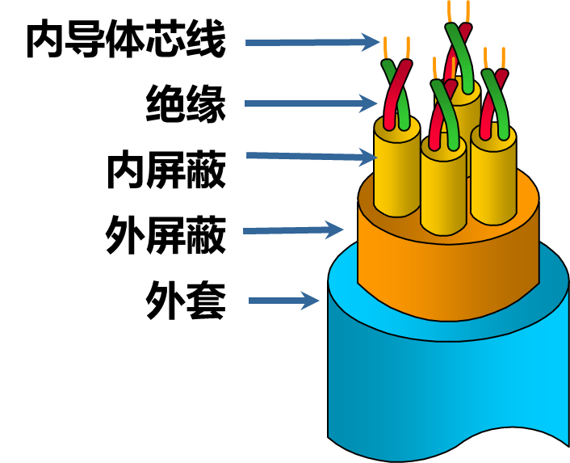
  - 特点：
    - 螺旋绞合的双导线
    - 每根4对、25对、1800对
    - 典型连接距离100m（LAN）
    - RJ45插座、插头
  - 优缺点：
    - 成本低
    - 组装密度高、节省空间
    - 安装容易（综合布线系统）
    - 平衡传输（高速率）
    - 抗干扰性一般
    - 连接距离短

应用的双绞线还分为屏蔽式和非屏蔽式：

- 屏蔽双绞线（STP）：以铝箔屏蔽以减少干扰和串音，应用较少。
  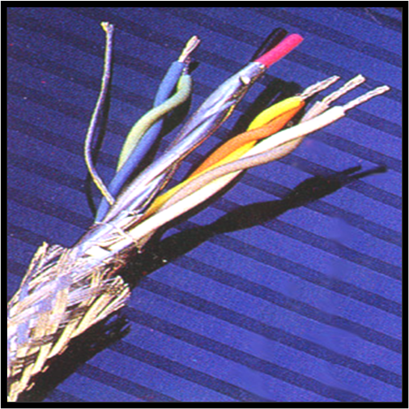
- 非屏蔽双绞线（UTP）：双绞线外无任何屏蔽层，应用广泛。
  

双绞线内部线对的连接标准：
|线对|色彩码|
|-|-|
|1|白蓝，蓝|
|2|白橙，橙|
|3|白绿，绿|
|4|白棕，棕|

混接白绿线对（交叉线）的标准为EIA-568B，用于**标准端口**；同色直接相连（直连线）的标准为EIA-568A，用于**级联端口**。

### 光纤

**光纤**（Optical Fiber，OF）依靠光波承载数据，光脉冲在玻璃纤维中传播。

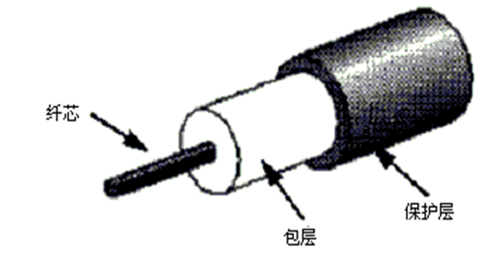

- 优缺点：
  - 传输带宽高，仅受光电转换器件的限制（＞100Gb/s）
  - 传输损耗小，适合长距离传输
  - 抗干扰性能极好、误码率低、保密性好
  - 轻便
  - 价格较高
  - 需要**光电转换**
- 纤芯材料：
  - 塑料
  - 二氧化硅（高纯玻璃）

光纤传输原理——光的反射：

- 光从折射率高的介质入射到折射率低的介质时会产生**折射**。折射量取决于两种介质的**折射率**。当入射角≥临界值时产生**全反射**，不会泄漏。（纤芯——折射率高，玻璃包层——折射率低）
- 亮度调制：有光脉冲为1，无光脉冲为0
- 光传输系统：光源、介质、光检测
  - 光源：波长850nm/1300nm/1500nm的发光二极管/激光二极管
  - 光检测器：光电二极管PIN/雪崩二极管APD
- 单向传输，双向需两根光纤
- 应用领域：局域网主干、电信网络、服务器连接

光纤可分为**单模光纤和多模光纤**。

- 多模光纤（MMF）：由二极管发光，**低速短距离**，2千米以内。多模光纤的芯线粗，传输速度低、距离短，整体的传输性能差，但其成本比较低，一般用于建筑物内或地理位置相邻的建筑物间的布线环境下，
  
- 单模光纤（SMF）：由激光作光源，仅有一条光通路，**传输距离长**，2千米以上。单模光纤是当前计算机网络中研究和应用的重点，也是光纤通信与光波技术发展的必然趋势。
  

为了保护光纤，我们需要为其外包保护层，形成**光缆**。光缆可分为**单芯光缆和多芯光缆**，构造分别如下图。

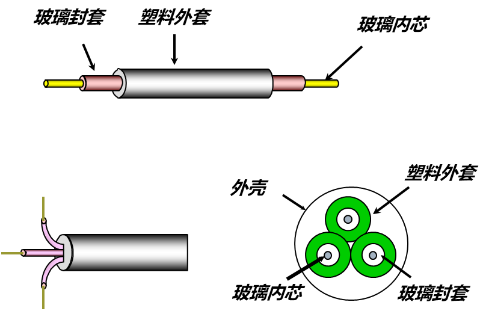

常见规格：

- 纤芯
  - 50um缓变型-MMF
  - 62.5um缓变型/增强型-MMF
  - 8.3um突变型-SMF
- 包层
  - 125um

### 无线介质

**无线介质**（信号在大气或外层空间自由传播）使用电磁波或光波携带信息。

- 优缺点：
  - 无需物理连接
  - 适用于长距离或不便布线的场合
  - 易受干扰
  - 反射，为障碍物所阻隔
- 主要类型：
  - 无线电、地面微波、通信卫星、红外线

**无线通信**是近年来信息通信领域中，发展最快、应用最广的，深入到人们生活的各个方面。其中WLAN（Wireless Local Area Network，无线局域网）、5G、UWB（Ultra Wideband，超宽带无线技术）、蓝牙等都是热门的无线通信技术应用。

无线传输所使用电磁波频段很广，国际电信联合会ITU（International Telecommunication Union）规定了波段正式名称，如低频（LF，长波，波长从1km-10km，对应于30kHz-300kHz）、中频（MF，中波，波长从100m-1000m，对应于300kHz-3000kHz）、高频（HF，短波，波长从10m-100m，对应于3MHz-30MHz），更高频段还有甚高频、特高频、超高频、极高频等。

**无线电波**是指在自由空间（包括空气和真空）传播的射频频段的电磁波。无线电技术是通过无线电波，传播声音或其他信号的技术。

- 微波通信
  - 通过地面站之间接力传送
  - 接力站之间距离：50-100km
  - 速率：每信道45Mb/s
    _日本NHK就是利用地面微波通信向公众免费传播电视信号。_
- 地球同步卫星
  - 与地面站相对固定位置
  - 使用三颗卫星即可覆盖全球
  - 传输延迟时间长（≈270ms）
  - 广播式传输
  - 应用领域：电视传输、长途电话、专用网络、广域网
- 激光
  - 将激光束调制成光脉冲传输数据
  - 频率更高，可获得更高的带宽
  - 激光束的方向性好，不受电磁干扰的影响，不怕偷听
  - 受天气影响
  - 只能在短距离通信中使用
- 红外线
  - 红外传输系统利用墙壁或屋顶反射红外线从而形成整个房间内的广播通信系统
  - 红外通信的设备相对便宜，可获得较高的带宽
  - 传输距离有限，而且**易受室内空气状态（例如有烟雾等）的影响**
- 短波无线电
  - 基站与终端之间通信采用无线链路
  - 应用领域：移动通信、无线局域网（WLAN）

我们来比较一下常用的几种通信介质的特性：
|传输介质|传输方式|速率/工作频带|传输距离|性能|价格|应用|
|-|-|-|-|-|-|-|
|双绞线|宽带/基带|不小于1GBb/s|模拟：10kM 数字：500M|较好|低|模拟/数字信号传输|
|50欧姆同轴电缆|基带|10Mb/s|不小于3kM|较好|较低|基带数字信号|
|75欧姆同轴电缆|宽带|不小于450MHz|100kM|较好|较低|模拟电视、数据及音频|
|光纤|基带|40Gb/s|不小于20kM|很好|较高|远距离高速数据传输|
|微波|宽带|4-6GHz|几百千米|好|中等|远程通信|
|卫星|宽带|1-10GHz|18000kM|很好|高|远程通信|

## 数据传输方式

数据传输以信号传输为基础，**在理想情况下，接收信号的幅度和波形应与发送信号完全一样**。数据传输方式可以从不同的角度划分，其传输方式有很多。常见的有：

- 单工、半双工和全双工；
  - 单工传输：信息发送只能是单方向的；即发送端只能发送，接收端只能接收；只有一个单向通道。如：电视机、收音机等。
  - 半双工传输：两设备之间有两个通道，但在任一段时间中，只能有一端发送数据，另一端接收数据，不能双向同时进行。如常见的无线对讲机等。
  - 全双工传输：两设备之间有两个通道，他们可以同时在两个方向上传输数据。如计算机之间的数据通信等。
    
- 基带传输和频带传输；
  - 基带信号固有频带称做基本频带，简称为**基带**。
  - 基带信号：信源发出的没有经过调制（进行频谱搬移和变换）的原始电信号，其特点是**频率较低**。通俗一点，基带信号就是发出的直接表达了要传输的信息的信号，比如我们说话的声波就是基带信号。由于在近距离范围内基带信号的衰减不大，从而信号内容不会发生变化。因此在传输距离较近时，计算机网络都采用基带传输方式。如从计算机到监视器等外设的信号就是基带传输的。**大多数的局域网使用基带传输。**
    _在计算机等数字设备中，二进制数字序列最方便的电信号形式为方波（即矩形脉冲信号），即1或0分别用高（或低）电平或低（或高）电平表示，通常人们把方波固有的频带称为基带，方波电信号称为基带信号。_
  - 在发送端基带传输的数据要经过编码器变换变为直接传输的基带信号，如**曼彻斯特编码**等；在接收端由解码器恢复成与发送端相同的矩形脉冲信号。
  - 将数字数据转换成模拟信号，利用模拟信道进行传输的方法称为频带传输；频带传输借助于模拟的正弦载波信号，用数字数据（0或1）调制载波，将数字数据寄生在载波的某个参数上（振幅、频率和相位），借助于模拟信道进行传输。它需要利用调制解调技术对数据进行转换。频带传输可以利用**频分多路复用**（FDM）实现多路复用，提高传输信道的利用率。
    
  - 调制（D/A）：将数字数据寄生在正弦载波的某个参数上，把数字数据转换成连续的模拟信号。
  - 解调（A/D）：将已调制信号还原为原来的数字数据。
  - 通过借助频带传输，**将信道分成多个子信道**，分别传送音频、视频和数字信号，称为**宽带传输**。宽带是指比音频带宽更宽的频带，它包括大部分电磁波频谱。使用这种宽频带传输的系统，称为宽带传输系统。即**把信号调制成频带为几十MHz到几百MHz的模拟信号**后再传送，接收方需要解调。宽带传输中的所有信道都可以同时发送信号。如CATV、ISDN等。
    
    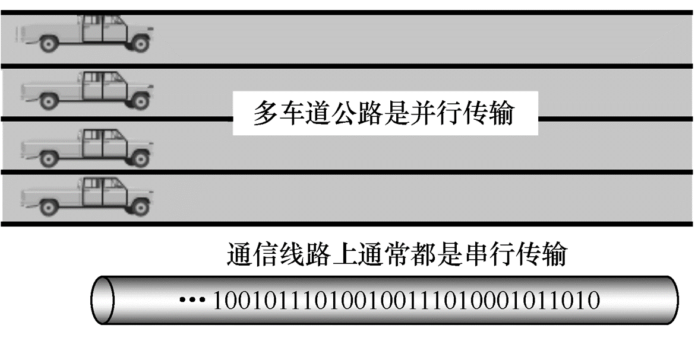
- 同步传输和异步传输等。

数据从发送端到接收端必须保持双方步调一致，这被称为**同步**。

同步的因素：

- 同步脉冲频率
- 数据从什么时候开始，什么时候结束
- 位边界
- 数据块边界

数据通信中需要在二个层次上实现同步：

- 位——位同步
  - 目的：使接收端与发送端在时间基准上一致
  - **外同步**——发送端发送数据之前发送同步脉冲信号，接收方用接收到的同步信号来锁定自己的**时钟脉冲频率**。
    
  - **自同步**——通过特殊编码（如曼彻斯特编码），**使数据编码信号中包含同步信号**，接收方从数据编码信号提取同步信号来锁定自己的时钟脉冲频率。
- 字符——字符同步或**帧**（Frame）——帧同步
  - 字符同步的目的：找到正确的字符边界
  - 采用这种同步方式的通信也称**异步通信或异步传输**
  - 帧同步的目的：识别一个帧的起始和结束
  - 帧：数据链路中的传输单位——包含数据和控制信息的数据块

解决同步问题的方法有**同步传输和异步传输**。

- 同步传输方式中以**称为帧的数据块为单位**进行传送。同步传输使用特殊的标志位进行帧同步，界定一个帧的始末。由于一个信息帧可以包含的位数很多，**同步传输还必须进行严格的位同步**，要求通信双方使用同一时钟信号进行发送与接收。
  
- 异步传输以字符为单位进行数据传输。每个字符前后通过加起始位和停止位来实现字符同步，通信的双方各自使用独立的基准定位时钟，但**要约定同样的传输速率**，以实现位同步。
  异步传输每个字符由四部组成：
  1. 1位起始位，以逻辑"0"表示；
  2. 5～8位数据位，即要传输的字符内容；
  3. 1位**奇偶校验**位，用于检错；
  4. 1～2位停止位，以逻辑"1"表示，用作字符间的间隔。
     

> 问：A、B两台设备进行异步数据传输，设定字符位数8位，传输速率9.6kb/s。如果双方的时钟相差0.1%，试问传输1个字符最大能造成多少微秒的累积错位？如果设计要求最大累积错位不超过位宽度的5%，是否达到了设计要求？如果双方的时钟相差1%，结果又如何？
> 答：在异步传输中，传输速率9.6kb/s，则每位时间为：1b÷9.6kb/s=104.17$\mu$s，如果字符位数8位，加上起始位、奇偶校验位和停止位可以有12位，当双方的时钟相差0.1%，最大的累积错位为：104.17$\mu$s×12×0.1%=1.25$\mu$s，占1.2%（1.25÷104.17）的位宽度，达到了设计要求。如果双方的时钟相差1%，最大的累积错位为：104.17$\mu$s×12×1%=12.5$\mu$s，占12%（12.5÷104.17）的位宽度，超出了设计要求。

**串行传输和并行传输**的效果示意图如下：

| 串行转为并行                                                   | 并行转为串行                                                   |
| -------------------------------------------------------------- | -------------------------------------------------------------- |
|  |  |

## 数据编码技术

数据编码类型总览：
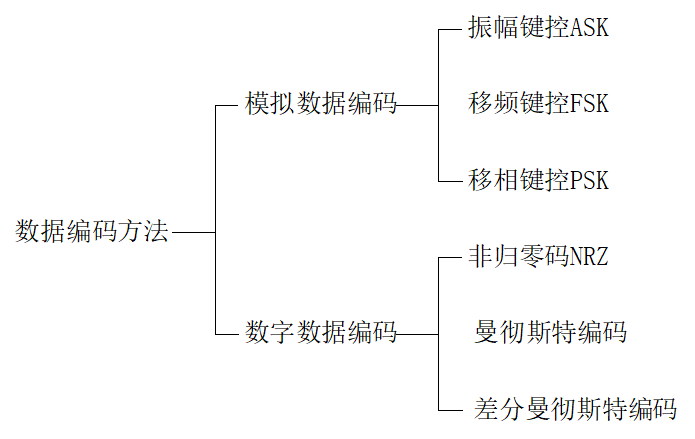

模拟数据编码即**频带传输的调制解调技术**等：

- 幅度调制
  - 幅度调制又称**移幅键控**（ASK），**频率**和**相位**都是常数，**振幅**为变量；即载波的幅度随发送的信号而变化，表示为：
    $$
    \begin{cases}\omega(t) = \omega_0\\\varphi(t) = \varphi_0\\A(t) = A_1, A_2, ..., A_n\end{cases}
    $$
- 频率调制
  - 频率调制又称**移频键控**（FSK），振幅和相位为常量，频率为变量，表示为：
    $$
    \begin{cases}A(t) = A_0\\\varphi(t) = \varphi_0\\\omega(t) = \omega_1, \omega_2, ..., \omega_n\end{cases}
    $$
- 相位调制
  - 相位调制又称**移相键控**（PSK），振幅、频率为常量，相位为变量，其函数表达式为：（相对相位调制：为0时相位相对前一个不变，为1时相位相对前一个变化）
    $$
    \begin{cases}A(t) = A_0\\\omega(t) = \omega_0\\\varphi(t) = \varphi_1, \varphi_2, ..., \varphi\end{cases}
    $$

数字数据编码方法：

- 基带传输在基本不改变数字数据信号频带（即波形）的情况下**直接传输**数字信号，可以达到很高的数据传输速率与系统效率；但数据在发送前要进行编码。
- 基带传输数字数据信号的编码方式主要有：
  - 非归零码（NRZ）
    - 用1表示高电位，0表示低电位；
    - NRZ码的缺点是无法判断一位的开始与结束，收发双方不能保持同步；
    - 为保证收发双方的同步，**必须在发送NRZ码的同时，用另一个信道同时传送同步信号**。
  - 曼彻斯特（Manchester）编码
    - 曼彻斯特编码是目前广泛使用的编码方法之一；
    - 0 = 由高电位转到低电位；
    - 1 = 由低电位转到高电位；
    - 且在每位期间中央处变换电位状态；
    - 利用电平跳变可以产生收发双方的同步信号；
    - 曼彻斯特编码信号又称做**自含钟编码**信号，发送曼彻斯特编码信号时无需另发同步信号；
    - 10-BASE-T网络常采用这种传输方式。
  - 差分曼彻斯特（Difference Manchester）编码（**相变式编码**）
    - 差分曼彻斯特编码是对曼彻斯特编码的改进；
    - 0 = 颠倒上一位的电位状态变化方式；
    - 1 = 沿用上一位的电位状态变化方式；
      差分曼彻斯特编码与曼彻斯特编码不同点主要是：
    - 每比特的中间跳变仅做同步之用；
    - 每比特的值根据其开始边界是否发生跳变来决定;
    - 一个比特开始处出现电平跳变表示传输二进制0，不发生跳变表示传输二进制1；
    - Token Ring网络采用这种传输方式。

## 多路复用技术

把两个以上的单独的信号合并起来，同时在一个通信线路上进行传输。这被称为**多路复用**。

多路复用技术的分类：

- 频分多路复用，FDM
  - 在物理信道的可用带宽超过单个原始信号所需带宽情况下，可将该物理信道的总带宽分割成若干个与传输单个信号带宽相同（或略宽）的子信道，每个子信道传输一路信号，这就是频分多路复用。
  - 在一条通信线路设计多路通信信道；
  - 每路信道的信号以不同的载波频率进行调制；
  - 各个载波频率是不重叠的，那么一条通信线路就可以同时独立地传输多路信号。
  - FDM主要用于模拟通信。
    _以下展示了FDM的一个应用实例_

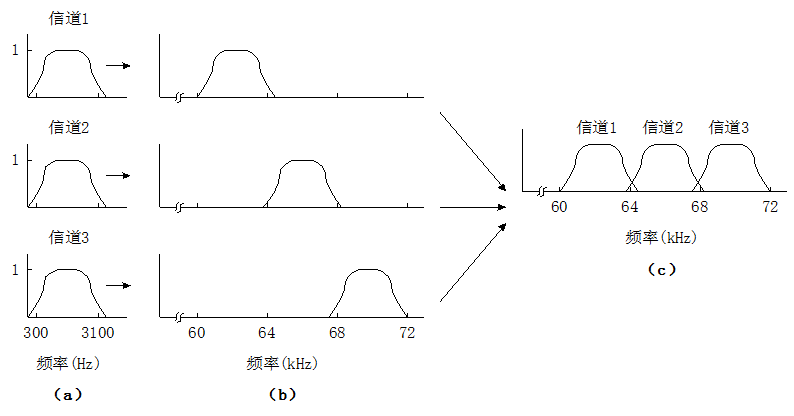

- 时分多路复用，TDM
  - 利用每个信号在时间上交叉，可以在一个传输通路上传输多个数字信号。常用于传输数字信号。时分多路复用不只局限于传输数字信号，模拟信号也可以同时交叉传输。另外，**对于模拟信号，时分多路复用和频分多路复用结合起来使用也是可能的**。一个传输系统可以频分许多条通道，每条通道再用时分多路复用来细分。
  - TDM 是将信道用于传输的时间划分为若干个时间片（时隙）；
  - TDM 将传输信号分成固定长度的帧，每个帧又划分若干个时间片；
  - 每个信号源分得一个时间片；
  - **在每个信号源占有的时间片内，它使用通信信道的全部带宽。**
    时分多路复用可分类：
  - 同步时分复用（STDM）
    - 将一帧中的各时隙以固定的方式预先分配给各路信号；主要缺点时隙的利用率低。
  - 异步（统计）时分复用技术（ATDM/STDM）
    - 异步时分复用技术又被称为**统计时分复用或智能时分复用**（ITDM）技术，它能动态地按需分配时隙，时间片位置与信号源没有固定的对应关系，突发数据的用户等可以利用其它信号源的时间片，以避免每帧中出现空闲时隙；能提高时隙的利用率。

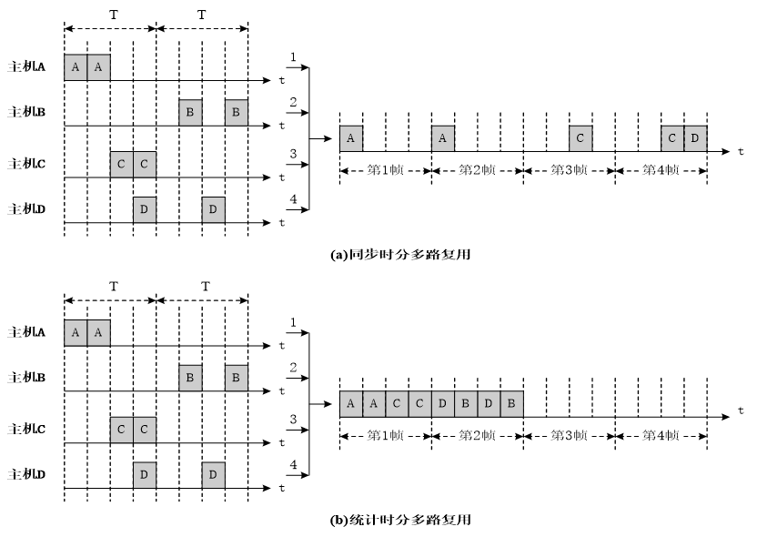

- 波分多路复用，WDM
  - 光纤通道（Fiber Optic Channel）技术采用了波长分隔多路复用方法，简称为**波分复用**；
  - 光信号的一个波长即一种频率；
  - 从概念上讲WDM和FDM是相同的，但WDM是对光信号的复合和分离；而FDM是对电信号的复合和分离；
  - 在一根光纤上复用80路或更多路的光载波信号称为**密集波分复用**（DWDM）；
  - 目前一根单模光纤的数据传输速率最高可以达到20Gb/s。

- 码分多路复用，CDM
  - 码分多路复用（Code Division Multiplexing）是指利用各路信号码型**结构正交性**而实现多路复用的通信方式，简称CDM。
  - 码分多路复用也是一种共享信道的方法，每个用户可在同一时间使用同样的频带进行通信，但使用的是基于码型的分割信道的方法，即每个用户分配一个地址码，各个码型互不重叠，通信各方之间不会相互干扰，抗干扰能力强。
  - **码分多路复用技术主要用于无线通信系统，特别是移动通信系统。**

## 数据交换技术

交换也称为**转接**。是在多结点网络中实现数据传输的技术，两结点要通信时，在双方之间建立一条物理的或逻辑的通道，称为**链路**。

常用的交换技术主要有：

- 线路交换
  - 线路交换是**面向连接**的服务；
  - 两台计算机通过通信子网进行数据交换之前，首先要在通信子网中建立一个实际的物理线路连接；
  - 线路交换在数据传输过程中要经过**建立连接、数据传输与释放连接**的三个阶段；
  - 线路交换方式的优点是：通信**实时性强**，适用于交互式会话类通信；
  - 线路交换方式的缺点是：**对突发性通信不适应**，系统效率低，**系统不具有存储数据的能力**。

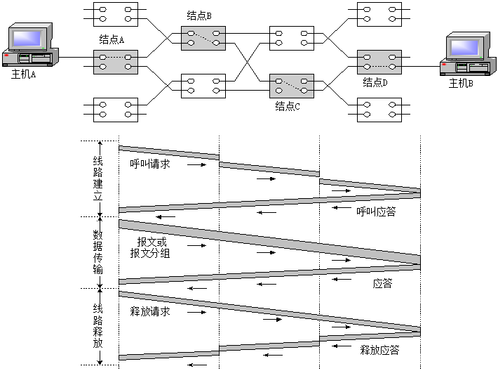

- 报文交换

  - 报文是网络中一次传输的信息块，它可以是一个程序、一个文件等。
  - **每个节点（交换设备）都对报文进行存储/转发**（缓存报文并根据目的地址转发）；
  - 报文传输不管发送数据的长度是多少，都把它当作一个逻辑单元发送；直到终点。
  - 适合于长报文、**无实时要求的通信**、不适合会话式通信。

    

- 分组交换

  - 分组（Packet）是传输的信息单位，长的报文可以分割成短的分组。
  - 分组交换又可分为**数据报分组交换和虚电路分组交换**两种。

    

数据报方式是通信子网将进入子网的分组当作“小报文”处理，**每个分组独立寻径，分组通常称**数据报\*\*\*\*。

- 同一报文的不同分组可以由不同的传输路径通过通信子网；
- **同一报文的不同分组到达目的结点时可能出现乱序、重复与丢失现象；**
- 每个分组在传输过程中都必须带有目的地址与源地址；
- 数据报方式报文传输延迟较大，**适用于突发性通信**，不适用于长报文、会话式通信。

虚电路方式在每次分组发送之前，**必须在发送方与接收方之间建立一条逻辑连接**。因为不需要真正去建立一条物理链路，连接发送方与接收方的物理链路已经存在。

- 一次通信的所有分组都通过这条虚电路顺序传送，因此报文分组不必带目的地址、源地址等辅助信息。分组到达目的结点时不会出现丢失、重复与乱序的现象。
- 每个分组传输都使用同一条路径传输。
- 虚电路方式与线路交换方式相同，整个通信过程分为**虚电路建立、数据传输和虚电路释放**。
- 虚电路是在传输分组时建立起的逻辑连接，称为“虚电路”是因为这种电路不是专用的。每个结点到其它结点间可能有无数条虚电路存在。
- 一个结点可以同时与多个结点之间具有虚电路。
- 由于虚电路方式具有分组交换与线路交换两种方式的优点，因此在计算机网络中得到了广泛的应用。

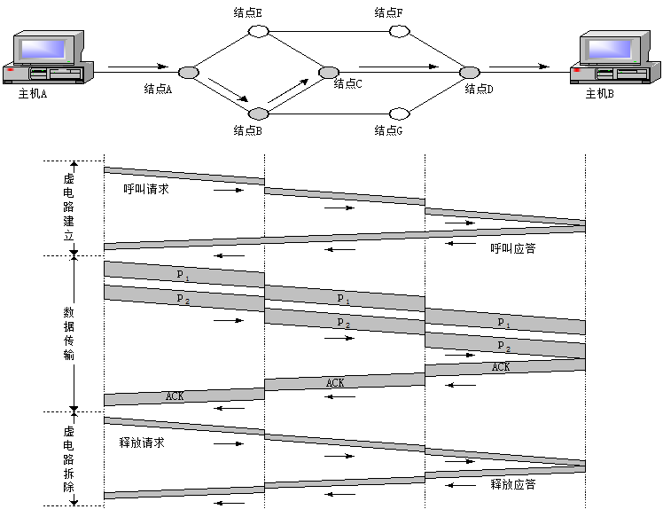

## 数据交换中的差错控制

数据在通信线上传输时，由于传输线路上的噪声或其他干扰信号的影响，使发送端发送的数据不能正确地被接收端接收，这就产生了**差错**。

差错可用误码率$P_e$来度量。常用的提高传输质量的方法主要有：

- 一是选择好的通信线路，即改善通信线路的电气性能，使误差的出现概率降低到系统的要求。
- 二是在通信线路上，设法检查错误，采取措施对错误进行差错控制；即**检错与纠错**。

目前常用的差错控制方法有下面三种：

- 前向纠错
  - 发送端根据一定的编码规则对信息进行编码，然后通过信道传输；接收端接收到信息后，如果检测到接收信息有错，则通过一定的算法，确定差错的具体位置，并自动加以纠正。
- 反馈检验法
  - 接收端将收到的信息码原封不动地发回发送端，与原发信息码比较。如果发现错误，则发送端重发。反馈检验的方法、原理和设备都比较简单，但需系统提供双向信道。
- 自动重发请求
  - 接收端检测到接收信息有错后，通过反馈信道要求发送端重发原信息，直到接收端认可为止，从而实现纠错。

差错控制编码的基本思想是在被传输信息中增加一些**冗余码**，利用附加的冗余码元和信息码元之间的约束关系加以校验，以检测和纠正错误。目前广泛用于差错检测的检错码有**奇偶校验码**和**循环冗余码**（CRC），用于纠错的纠错码有**海明码**和**BCH码**。

差错控制用得最广泛的方法还是发**检错码**，即分组仅包含足以使接收端发现差错的冗余信息，接收端发现错误后反馈给发送端，发送端重发信息，直至正确接收为止，这种方式称反馈重发纠错。如下图:

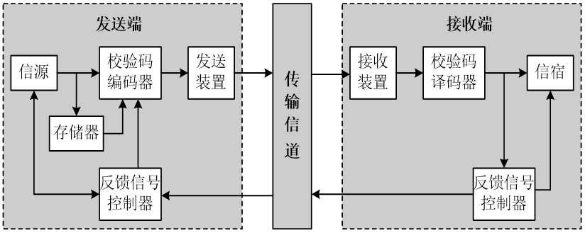

**CRC是目前应用最广的检错码编码方法之一。**

### 奇偶校验和循环冗余校验

奇偶校验中，偶校验要在每一个字符上增加一个附加位，使该字符串中“1”的个数为偶数；在奇校验时，要在每一个字符上增加一个附加位，使该字符串中“1”的个数为奇数。接收端检测位数的奇偶性以确定是否有差错发生。

**奇偶校验并不是一种十分安全可靠的检错方法**，如果有偶数个数据位在传输中同时出错，接收端无法检测出差错的数据，所以其检错概率为50%。但对于低速传输来说，奇偶校验是一种令人满意的检错法。

循环冗余校验码是基于**将位串看成是系数为0或1的多项式**，一个k位帧可看成是从 $x^{k-1}$ 到 $x^0$ 的k次多项式的系数序列，这个多项式的阶数为 $k-1$。高位（最左边）是 $x^{k-1}$ 项系数，下一位是 $x^{k-2}$ 的系数，以此类推。例如，*110001*有6位，它的6个多项式系数分别是1、1、0、0、0、1，表示成多项式是 $x^5 + x^4 + x^0$。如果采用多项式编码的方法，发送方和接收方必须事先商定一个生成多项式 $G(x)$，**生成多项式的最高位和最低位必须是1**。

对于CRC码 $(n,k)$，信息码对应一个 $(k - 1)$ 次多项式 $K(x)$，校验码对应一个 $(r - 1)$ 次多项式 $R(x)$，由 $k$ 位信息码和 $r$ 位校验码组成 $n = k + r$ 位的码 $(n,k)$ 对应一个 $(n - 1)$ 次的多项式，设为 $C(x)$，则：$C(x) = x^rK(x) + R(x)$（$x^rK(x)$ 相当于在 $K(x)$ 后加 $r$ 个零）。

由信息码产生校验码的过程，即由已知的 $K(x)$ 求 $R(x)$，其方法是用一个特定的多项式 $G(x)$（$G(x) = x^r +...+ 1$）去除 $x^rK(x)$，所得的 $r$ 位余数作为校验码，即为 $x^rK(x)/G(x)$ 的余数，其中 $G(x)$ 称为**生成多项式**，这里的除法用**无借为减**来实现（相当于做**异或运算**）。如果有余数，则认为传输出错。

对此有疑问，可以观看[CRC校验的可视化过程](https://www.bilibili.com/video/BV1V4411Z7VA/)。

> 问：位流*10011101*使用标准的CRC发送。生成多项式是 $x^3+1$。请说明实际发送的位串。假定左起第3位在传输期间变反了，说明该差错在接收方是怎样被检测到的。
> 答：位流是*10011101*，生成多项式是*1001*，（$r$ 为3）在位流后面附加3个0变成*10011101000*，用*1001*去除*10011101000*的余数是*100*。因此实际发送的位串是*10011101100*。收到的第3位变反了的位流是*10111101100*。用*1001*去除这个位串产生余数*100*，由于余数不是0，接收方就知道传输过程中发生了差错，可以请求重传。

**纠错码**是指在发送每一组信息时发送足够的附加位。接收端通过这些附加位在接收译码器的控制下不仅可以发现错误，而且还能自动地纠正错误。要求附加的冗余码较多，这将会降低传输的效率。

目前常见的纠错码有：

- 海明纠错码
- 正反纠错码
- BCH 纠错码
