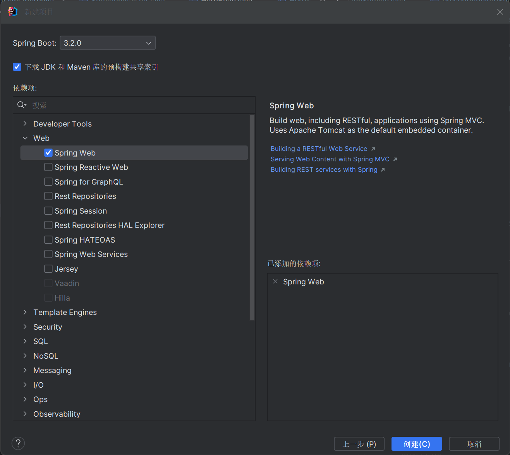
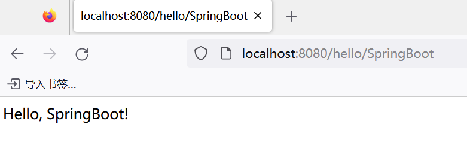
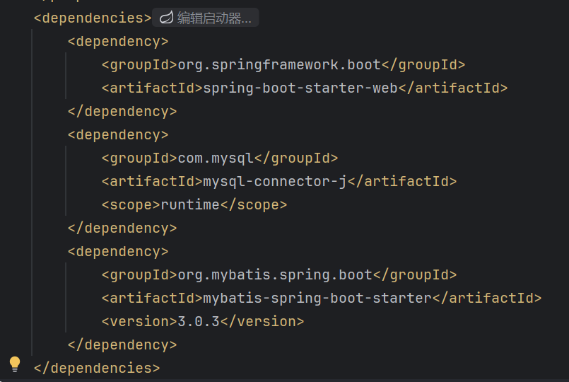

# SpringBoot

传统 Spring 程序由 **Spring Framework** 提供支持，将若干个 Spring 子项目联系到一起。但随着项目规模扩大，构建、组织项目的难度不断提升......构建完后，我们还得手动将 war 包放置到 Tomcat 中......如果需要更新配置，还需要重新构建，极其耗时......

SpringBoot 旨在解决这些问题（**起步依赖、自动配置**......），使得我们不用再在项目管理上浪费时间，从而可以聚焦于业务开发。

## Hello, SpringBoot!

本节目标是快速创建一个 Web 服务端控制器，用户访问 *http://localhost:8080/hello/SpringBoot* 可得到字符串 “Hello, SpringBoot!”。

:::tip
最新的 SpringBoot 3 最低要求 JDK 17，请确保你已经**跟上时代**。
:::

在 IntelliJ IDEA 中 创建 SpringBoot 工程很简单，按照需要选择语言、包管理器、包名等信息后，点“下一步”：


:::warning
SpringBoot 已内嵌 Tomcat，我们不必将其构建为 war 包——jar 包就可以了。
:::

选中 **Spring Web** 起步依赖，它包含了我们在 Spring 中所有要用到的 Web 服务类的基础依赖，点“创建”即可得到空工程。



至于三方技术整合，我们会在后面提到。

空工程里，默认会有一个 XxApplication 类，并含有久违的 *main* 方法。

```java
package net.penyo.webbedrock;

import org.springframework.boot.SpringApplication;
import org.springframework.boot.autoconfigure.SpringBootApplication;

@SpringBootApplication
public class WebBedrockApplication {

    public static void main(String[] args) {
        SpringApplication.run(WebBedrockApplication.class, args);
    }
}
```

一个 SpringBoot 应用程序就是从这里启动。

不过我们关注点不在这，应该先去创建一个 Controller：

```java
package net.penyo.webbedrock.controllor;

import org.springframework.web.bind.annotation.GetMapping;
import org.springframework.web.bind.annotation.PathVariable;
import org.springframework.web.bind.annotation.RestController;

import static java.lang.StringTemplate.STR;

@RestController
public class HelloController {

    @GetMapping("/hello/{what}")
    public String hello(@PathVariable String what) {
        return STR."Hello, \{what}!";
    }
}
```

与之前提到的 `@Controller` 不同，`@RestController` 表示当前控制器采用 **RESTful** API；`@PathVariable` 表示路径中所包含的变量。

:::details 你知道吗：什么是 RESTful API？

REST 全称是**表述性状态转移**，被表述的内容物是资源。任何事物，只要有被引用到的必要，它就是一个资源。资源可以是实体，也可以只是一个抽象概念。

要让一个资源可以被识别，需要有个唯一标识，在 Web 中这个唯一标识就是 URI（Uniform Resource Identifier）。

RESTful API 没有引入任何新技术，只是对当前已有的技术作了进一步规范。比如 GET、HEAD、PUT 和 DELETE 请求都是幂等的，无论对资源操作多少次，结果总是一样的，后面的请求并不会产生比第一次更多的影响。

更详细的讲解可参考[外部文献](https://www.runoob.com/w3cnote/restful-architecture.html)。

:::

启动应用程序，访问 *http://localhost:8080/hello/SpringBoot* 可见：



## 配置自动导入

我们应用程序的配置一般放在 `application.properties` 或 `application.yml` 中。按照惯例，我们继续沿用 yml 形式：

:::tip

采用 yml 或 yaml 后缀不会影响 SpringBoot 识别。

:::

```yml
黑手:
  喜欢说的话: "阿米诺斯"
  技能: "让你飞起来"
```

使用注解 `@Value`（作用于成员，Spring 提供）或 `@ConfigurationProperties`（作用于类/方法，SpringBoot 提供）导入配置：

```java
// 或者直接在这写 @ConfigurationProperties(prefix = "黑手")
// 但必须确保成员名完全匹配！
public Class 神鹰哥 {
  @Value("${黑手.喜欢说的话}")
  private String 口头禅;

  @Value("${黑手.技能}")
  private int 要做的事;
}
```

:::tip
两种注解并不冲突，但 `@ConfigurationProperties` 更加优先。
:::

:::warning
[Lombok](https://zhuanlan.zhihu.com/p/272516657) 提供了一种过时的近似实现（`@Data`），不推荐使用。
:::

练习一下：8080 端口是一个“热门位置”，请在配置文件里修改 Tomcat 自 24681 端口启动：

```yml
server:
  port: 24681
```

## 面向复杂业务的层次设计

在学习 Spring 时，我们认为一个 Web 系统后端应该这样分层：

```mermaid
graph
    sys["System"]
    sys -.- c["Controller"]
    sys -.- s["Service"]
    sys -.- d["Data Access Object"]
    sys -.- p["Plain Old Java Object"]
```

其中 DAO 既可以是 Repository（如 JPA），也可以是 Mapper（如 MyBatis）。除此以外其实还有 Config、Utility 等，只不过它们没那么关键，不予列出。

我们现在重点是要讨论一下数据容器的设计。

与简单的 POJO 不同，当年的 EJB（Enterprise Java Beans）认为数据容器需要分为以下五类：

- VO（View Object）：**视图对象**，用于展示层，它的作用是把某个指定页面（或组件）的所有数据封装起来。
- DTO（Data Transfer Object）：**数据传输对象**，这个概念来源于 J2EE 的设计模式，原来的目的是为了 EJB 的分布式应用提供粗粒度的数据实体，以减少分布式调用的次数，从而提高分布式调用的性能和降低网络负载，但在这里，更符合泛指用于展示层与服务层之间的数据传输对象。
- BO（Business Object）：**业务对象**，把业务逻辑封装为一个对象，这个对象可以包括一个或多个其它的对象。
- PO（Persistent Object）：**持久化对象**，它跟持久层（通常是关系型数据库）的数据结构形成一一对应的映射关系，如果持久层是关系型数据库，那么，数据表中的每个字段（或若干个）就对应PO的一个（或若干个）属性。
- DO（Domain Object）：**领域对象**，就是从现实世界中抽象出来的有形或无形的业务实体。

这五类对象的属性非常相像，但并不完全相同。如果忽略项目规模直接上 EJB 只会徒增烦恼。在日常的开发里，个人建议：

- 项目规模较小时，只需要设计 POJO；
- 项目规模一般时，需要设计 PO 和 DTO/VO。

更好的解释请参考[外部文档](https://www.cnblogs.com/javazhiyin/p/15682813.html)。

## JPA？MyBatis？

JPA（Java Persistence API）和 MyBatis 都是持久化框架，前者是 Jakatar EE 的一部分，当操作对象与表结构基本一致时，效率最高；后者可以编写灵活的 SQL 语句来控制查询方案，广受好评。

在已经建立的项目中添加起步依赖，找到 *pom.xml* 的依赖节点，顶部会显示“编辑启动器”：



选好依赖后，IJ 会自动安装它们。

这里我们继续用 MyBatis，但是全注解：

```java
package net.penyo.webbedrock.mapper;

import net.penyo.webbedrock.po.Neko;
import net.penyo.webbedrock.util.DynamicSql;
import org.apache.ibatis.annotations.*;
import org.springframework.stereotype.Repository;

import java.util.List;

@Repository
@Mapper // 提醒 MyBatis
public interface NekoMapper {

    @Insert("insert nekos (name, gender, age, skin_color, father_id, mother_id) values (#{name}, #{gender}, #{age}, #{skinColor}, #{fatherId}, #{motherId})")
    @Options(useGeneratedKeys = true, keyProperty = "id")
    int insert(Neko neko);

    @Delete("delete from nekos where id = #{id}")
    int delete(int id);

    @Update("update nekos set name = #{name}, gender = #{gender}, age = #{age}, skin_color = #{skinColor}, father_id = #{fatherId}, mother_id = #{motherId} WHERE id = #{id}")
    int update(Neko neko);

    @SelectProvider(type = DynamicSql.class, method = "query") // 动态 SQL
    List<Neko> query(Neko neko);
}
```

以及更优雅地实现依赖注入：

```java
package net.penyo.webbedrock.controllor;

import net.penyo.webbedrock.po.Neko;
import net.penyo.webbedrock.service.NekoService;
import org.springframework.beans.factory.annotation.Autowired;
import org.springframework.http.ResponseEntity;
import org.springframework.web.bind.annotation.*;

import java.util.Optional;

@RestController
@RequestMapping("/neko")
public class NekoController extends BaseController {

    private final NekoService nekoService;

    @Autowired
    private NekoController(NekoService nekoService) {
        this.nekoService = nekoService;
    }

    // ......
}
```

## Spring Validation

这是一个参数校验框架，你可以使用它提供的注解简单地完成参数校验。

**使用前记得添加起步依赖。**

需要在要用到检验的控制器上标注 `@Validated`，并在要用的形参上标注 `@Pattern` 以用正则验证：

```java
@RestController
@RequestMapping("/neko")
@Validated
public class NekoController extends BaseController {

    private final NekoService nekoService;

    @Autowired
    private NekoController(NekoService nekoService) {
        this.nekoService = nekoService;
    }

    @DeleteMapping("/delete/{id}")
    public ResponseEntity<Boolean> delete(@PathVariable @Pattern(regexp = "^\\d{1,3}$") String id) {
        return ResponseEntity.ok(nekoService.delete(id));
    }
}
```

如果参数不合规，后端会返回 HTTP 500 状态码并抛出异常，但不会妨碍运行。

## JWT？Spring Security？

JWT（JSON Web Token）和 Spring Security 都是用于构建用户系统的关键组件，后者比前者要重得多。为了开发简便，这里只介绍 JWT 如何使用。

由于 HTTP 本身不具备状态，所以用户每次请求必须携带了有关自己的信息，好让服务器知道到底是谁、要在什么的基础上干什么。而 JWT 是用户特征的体现，正好符合最低要求。

JWT 构成如下：

```mermaid
graph LR
    subgraph c[Signature]
        hash
    end
    subgraph b[Payload]
        data
    end
    subgraph a[Header]
        alg
        type
    end
    
    a -- "." --> b -- "." --> c
```

第一部分（头部）确定了最后的加密算法和令牌类型；第二部分（有效负荷）记载了非敏感用户数据；第三部分（签名）将多种信息混合在一起并摘要，以确保令牌不被篡改。

只要 JWT 被篡改或者过期，有效数据就无法从中被解析出来，也就验证不了身份了。由于这是双向加密，所以服务端手里会有密钥，妥善保存好它也很重要。

用户登录时，服务器会计算出一个 JWT，并返回给用户，每次用户请求都**在请求头里**携带 JWT，直到它过期或手动作废。

```java
// 不登陆（且不是管理员）就不许操作！

@PostMapping("/insert")
public ResponseEntity<Boolean> insert(@RequestHeader String token, Neko neko) {
    String who = Jwt.read(token);
    if (who == null)
        return ResponseEntity.status(HttpStatus.FORBIDDEN).build();
    if (!userService.isAdmin(who))
        return ResponseEntity.status(HttpStatus.UNAUTHORIZED).build();
    return insert(neko);
}
```

## Swagger

