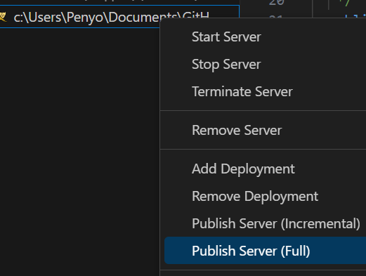
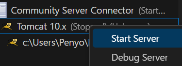
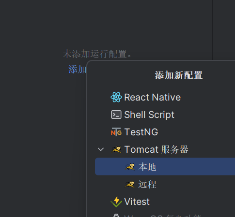
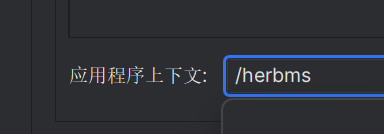
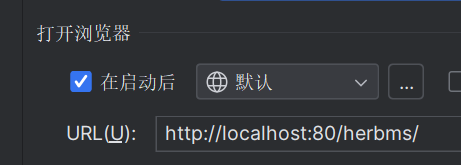

# Servlet 技术

**Servlet**，Server Applet 的缩写，意为服务器小程序，是 Java 面对 Web 开发的一个接口，一般来说，任何实现了该接口的类都属于 Servlet 技术。其包名为 `javax.servlet` 或 `jakarta.servlet`。`javax.servlet.http` 或 `jakarta.servlet.http` 专职负责 HTTP 请求。**任何 Servlet 程序都不能直接运行在浏览器上，而是需要在 Tomcat 服务器上才能运行。**

> 2017 年 8 月，Oracle 决定将 Java EE 移交给开源组织，最后 Eclipse 基金会接手。不过，甲骨文不允许开源组织用 Java 的名号，于是 Eclipse 选出了 **Jakarta EE** 和 **Enterprise Profile** 两个后续名字，最终前者以 64.4% 的票数获胜。也就是说，Java EE 已经正式更名为 Jakarta EE（雅加达）。

:::tip
Tomcat 9 及之前的版本沿用 `javax.*` 的包名，自 Tomcat 10 起，已变更为 `jakarta.*`。
:::

## Tomcat 快速应用

:::warning
再次警告！Servlet 程序或应用了 Servlet 技术的网站**必须**依托 Tomcat 运行！且 _\*.jsp_ 文件不能够直接在浏览器中打开，因为其本质是一个 Java 程序！
:::

**Tomcat** 是 Apache 出品的一款开源的 Web 应用服务器，属于轻量级应用服务器，在中小型系统和并发访问用户不是很多的场合下被普遍使用，是开发和调试 JSP 程序的首选。另外它还是一个 **Servlet 和 JSP 容器**，独立的 Servlet 容器是 Tomcat 的默认模式。不过，Tomcat 处理静态 HTML 的能力不如 [**Apache 服务器**](https://zhuanlan.zhihu.com/p/39504100)。

你可以在 Apache 官网上下载到 Tomcat，至于版本选择，根据需求即可（若是新项目则建议从 Tomcat 10 用起），这里不再赘述。

安装过程中可以配置映射端口，**默认是 8080**，你可以根据需要将其更改为 HTTP 默认端口（80）或 HTTPS 默认端口（443）。若更改为 80（接下来全部默认是这样配置的），则启动服务器（_bin/Tomcat.exe_）后以 _localhost_ 或 _127.0.0.1_ 访问测试页面。

Tomcat 默认映射 _webapps/ROOT_ 文件夹，若需要更改目标目录，则打开 _conf/server.xml_，对 _Server>Service>Engine>Host_ 增加：

```xml
<Context path="/" docBase="目标目录路径" />
```

Tomcat 不能直接访问 _webapps_ 以外的文件，因此借助 Context 完成虚拟路径映射。其中 path 表示映射到，若 path="/"，则表示将 docBase 直接映射到 localhost。了解更多见[此](https://cloud.tencent.com/developer/article/1834693)。

Tomcat 默认载入目录下的 _index.html_ 或 _index.htm_ 或 _index.jsp_（按顺序尝试，失败则尝试下一个），即你可以不指定文件名就可以访问它们。这被配置在 _conf.web.xml_ 中的 _web-app>welcome-file-list_ 中。

若载入的文件为 html/htm，确保你在头部有以下标签：

```html
<meta charset="UTF-8" />
```

若载入的文件为 jsp，则确保你的文件头有这样的描述：

```xml
<%@ page pageEncoding="UTF-8"%>
```

它保障了页面以 Unicode 字符集载入，确保中文不会乱码。

在一个典型 Maven webapp 原型工程中，_WEB-INF>classes_ 存放需要用到的字节码文件（我们自行编写的与 Servlet 相关的类）。_WEB-INF_ 是 Java 的 Web 应用的安全目录。所谓安全就是客户端无法访问，只有服务端可以访问的目录。如果想在页面中直接访问其中的文件，必须通过 _web.xml_ 文件对要访问的文件进行相应映射才能访问。

webapp 原型提供了 _package_ 插件，它可以自动地帮我们关联资源（_servlet-api_ 等），并把结果放在 _target_ 中。项目编写完毕后，我们直接运行该插件即可。

:::details 你知道吗：如何使 IDE 自动帮我们快捷“运行”？

- VS Code：

  1. 下载 Community Server Connectors 插件

     

  2. 添加本地 Tomcat 执行目录

     

     

  3. 添加部署（_package_ 所产生的目录）并发布

     

     

  4. 启动 Tomcat

     

- IntelliJ IDEA

  1. 添加 Tomcat 本地运行实例

     

  2. 添加构建工件

     

  3. 设置映射地址、勾选自动启动

     

     

  4. 运行

     

:::

:::info Tomcat 输出的日志不能正常显示？
将 _conf/logging.properties_ 中 java.util.logging.ConsoleHandler.encoding 的值改为 GBK。
:::

:::info Tomcat 提示“协议处理程序初始化失败”？
试试：

```txt
netstat -aon|findstr "80"
```

这将列出所有使用 80 端口的应用程序，记下它们的 PID（最后一列），然后使用：

```txt
taskkill -PID 占用者的PID -F
```

:::

## Servlet 接口

一个 Servlet 对象存在**生命周期**：

```mermaid
graph LR
subgraph JVM
 SC["Servlet Container"]
 subgraph Servlet
  init["init()"]-->service["service()"]-->destroy["destroy()"]
 end
 SC-->init
 SC--Thread A---->service
 SC--Thread B---->service
 SC--Thread C---->service
 SC-->destroy
end
WS["Web Server"]-->SC
```

接口提供了 3 个生命周期方法（**你不能直接调用它们，而是由容器调用！**）：

| 方法名                                                                | 说明                                         |
| --------------------------------------------------------------------- | -------------------------------------------- |
| public void init(ServletConfig config)                                | 初始化 Servlet。它只能被 Web 容器调用一次。  |
| public void service(ServletRequest request, ServletResponse response) | 为进入的请求提供响应。它在每次请求时被调用。 |
| public void destroy()                                                 | 销毁 Servlet。它只能被调用一次。             |

和两个常规方法：

| 方法名                                  | 说明                                            |
| --------------------------------------- | ----------------------------------------------- |
| public ServletConfig getServletConfig() | 返回 ServletConfig 的对象。                     |
| public String getServletInfo()          | 返回有关 Servlet 的信息，如作者、版权、版本等。 |

获得一个 Servelt 对象有多种办法，可以直接选择实现接口（极其复杂）、继承自 **GenericServlet** 类或 **HttpServlet** 类。

:::details 你知道吗：GenericServlet 与 HttpServlet 的区别是？
GenericServlet 是一个抽象类，实现了 Servlet 接口，并且对其中的 `init()` 和 `destroy()` 和 `service()` 提供了默认实现。在 GenericServlet 中，主要完成了以下任务：

- 将 `init()` 中的 ServletConfig 赋给一个类级变量，可以由 `getServletConfig()` 获得；
- 为 Servlet 所有方法提供默认实现（**其中要求子类必须重写 `service()`**）；
- 可以直接调用 ServletConfig 中的方法

HttpServlet 也是一个抽象类，它进一步继承并封装了 GenericServlet（重写了父类的 `service()` 且新增了自己的 `service()` 以确定如何处理请求），使得使用更加简单方便，由于是扩展了 Http 的内容，所以还需要使用 HttpServletRequest 和 HttpServletResponse，这两个类分别是 ServletRequest 和 ServletResponse 的子类。

若通过继承 HttpServlet 来获得 Servlet 对象，则只需要聚焦于编写 `doGet()` 或 `doPost()` 即可。
:::

:::info 编译 Servlet 的类提示*找不到类*？
将 _servlet-api.jar_ 拷贝到工程目录下，试试：

```txt
javac -encoding UTF-8 -cp *.jar *.java
```

:::

## Servlet 引入与虚拟路径映射

为了使具体的 Servlet 类与待请求路径挂钩，我们需要配置 _web.xml_ 或为 Servlet 类增加注解。

第一种方法，在目录 _webapp_ 里增加 _web.xml_：

```xml
<servlet>
    <!-- 指定 Servlet 的名称 -->
    <servlet-name>ServletClassName</servlet-name>
    <!-- 在 WEB-INF/classes 中具体的位置 -->
    <servlet-class>com.example.DemoServlet</servlet-class>
</servlet>
<servelt-mapping>
    <servlet-name>ServletClassName</servlet-name>
    <!-- 指定能映射到指定 Servlet 的路径，可以不止一个 -->
    <url-pattern>/demo</url-pattern>
    <!-- 亦可以使用通配符*来表示范围 -->
    <url-pattern>*.jsp</url-pattern>
    <url-pattern>/demo/*</url-pattern>
</servelt-mapping>
```

该方法便于集中管理，但是配置麻烦、模块化差。因此推荐第二种办法，直接为 Servlet 类源代码的类添加注解：

```java
@WebServlet("/demo")
// 参数只有 urlPattern 时，可以省略键名。全写应该是 @WebServlet(urlPattern = "/demo")
// 需要映射到多个路径可用 @WebServlet({"/demo", "/demo2"})
```

这样前端向我们的 _urlPattern_ 发送的请求就能被指定的 Servlet 处理。

## ServletConfig 接口

`ServletConfig` 接口的实现类是 Servlet 程序的配置信息类。

Servlet 程序和 ServletConfig 对象都由 Tomcat 负责创建，我们负责使用。Servlet 实例是首次被访问的时创建，ServletConfig 是每个 Servlet 实例创建时随之产生的。

## HttpServletRequest 接口

当用户的请求送达 Tomcat 时，Tomcat 会将请求打包成 `ServletRequest` 对象、产生“空白”的 `ServletResponse` 对象，并**根据请求路径**交给指定 Servlet。若该 Servlet 尚未实例化，就会顺便实例化（懒加载）。

ServletRequest 和 ServletResponse 对象会被进一步传入 `service()`，**被处理完后**将响应数据填充到 ServletResponse 中。Tomcat 再把响应数据返回给用户。

:::tip
`HttpServletRequest` 接口直接继承自 `ServletRequest` 接口，响应数据包同理。
:::

若请求使用 HTTP 协议，我们在编写具体 Servlet 实现类时应该实现 `HttpServlet` 接口，其 `service()` 接收 HttpServletRequest 和 HttpServletResponse 对象。ServletRequest 和 ServletResponse 对象被传入时发生**向下转型**。

:::details 你知道吗：ServletRequest 实例具体是怎么被创建出来的呢？
虽然 `ServletRequest` 和 `HttpServletRequest` 都是接口，但 _servlet-api.jar_ 中有一个 `RequestFacade` 类，实现了 `HttpServletRequest`。实例就是在这里被创建的。
:::

`HttpServletRequest` 提供了很多方法：

- 与[请求行](./http.md#请求消息)相关：

  | 方法名                  | 说明                                                   |
  | ----------------------- | ------------------------------------------------------ |
  | String getMethod()      | 获取方法名。如 GET、POST。                             |
  | String getContextPath() | 获取虚地址。即 webapp 项目的根路径。                   |
  | String getServletPath() | 获取 Servlet 地址。                                    |
  | String getQueryString() | 获取查询参数的字符串。                                 |
  | String getRequestURI()  | 获取 URI。等效于 getContextPath() + getServletPath()。 |
  | String getRequestURL()  | 获取 URL。等效于 "http://" + getRequestURI()。         |
  | String getProtocol()    | 获取协议。如 HTTP/1.1。**由父接口提供。**              |
  | String getRemoteAttr()  | 获取客户机地址。通常是 IP 地址。                       |

- 与请求头相关：

  | 方法名                               | 说明                         |
  | ------------------------------------ | ---------------------------- |
  | String getHeader(String name)        | 通过请求头名称（键）获取值。 |
  | Enumeration\<String> getHeaderName() | 获取所有请求头名称。         |

  :::tip
  `Enumeration` 在官方文档中被定义为**枚举**接口，但实质是一个**只读的**迭代器（`Iterator`）。

  它自 JDK 1.0 就出现了。
  :::

  :::tip
  实践中：

  - 常用形如 _getHeader("user-agent").contains("Chrome")_ 的语句来判断用户来自哪个平台。
  - 常用形如 _getHeader("referer").conatins("google.com")_ 的语句判断用户是否来自指定源（**防盗链技术**）。

  :::

- 与请求体（**当请求方式为 POST 时才存在！**）有关：

  | 方法名                                | 说明                                                               |
  | ------------------------------------- | ------------------------------------------------------------------ |
  | BufferedReader getReader()            | 获取字符输入流。只能解析纯文本。                                   |
  | ServletInputStream getInputStream()   | 获取字节输入流。可以解析任何数据。                                 |
  | void setCharacterEncoding(String env) | 设置流编码。当使用 POST 传输中文纯文本时有意义。**由父接口提供。** |

  :::tip
  如果仅仅是表单请求，则全部的参数会挤在一行中。使用 `getReader()` 读取第一行即可，其内容与 `getQueryString()` 一致。
  :::

基于这些基本方法，又产生了一些高层方法：

| 方法名                                   | 说明                                               |
| ---------------------------------------- | -------------------------------------------------- |
| String getParameter(String name)         | 获取请求参数。调用无需关心请求方式为 GET 或 POST。 |
| String[] getParameterValues(String name) | 获取请求参数组。当一个键对应一组值时适用。         |
| Enumeration\<String> getParameterNames() | 获取全部请求参数名称。                             |
| Map<String, String[]> getParameterMap()  | 获取全部请求参数。                                 |

## 请求转发

当我们需要请求辗转多个 Servlet 时，需要涉及到**请求转发**。

- 使用请求对象的转发器

  1. 获取转发器：

     ```java
     RequestDispatcher getRequestDispatcher(String path);
     ```

  2. 调用 `forward()`：

     ```java
     void forward(ServletRequest req, ServletResponse resp);
     ```

  :::tip
  `RequestDispatcher.forward()` 的行动只影响服务器内部，客户端无法看见地址变动；但对于 Servlet 而言，转发本身相当于另一次请求。
  :::

## 数据传递

请求（request）本身可以携带数据，这使得 Servlet 间可以互相交流。

涉及存取数据的方法：

| 方法名                                     | 说明             |
| ------------------------------------------ | ---------------- |
| void setAttribute(String name, Onject obj) | 存储数据。       |
| Object getAttribute(String name)           | 根据键获取数据。 |
| void removeAttribute(String name)          | 根据键移除数据。 |

:::tip
由于 jsp 也是一种 Servlet，所以这常被用于 jsp 和 Servlet 间交换数据。
:::

有时，为了扩大数据生命周期，我们不得不选择比 request 更“持久”的数据容器：

| 容器类型       | 描述                                                       |
| -------------- | ---------------------------------------------------------- |
| HttpSession    | 会话。用户首次请求时产生，关闭会话（浏览器）时被 GC。      |
| ServletContext | 应用程序。Tomcat 首次收到请求产生，服务器终止运行时被 GC。 |

:::tip
`HttpServletRequest`、`HttpSession`、`ServletContext` 都近似实现了 `java.util.Map` 的部分功能，因此它们在操作数据上的行为与 `Map` 基本一致。
:::

## Session 类

## ServletContext 接口

一个 Web 应用，只对应一个 ServletContext，也就是说，ServletContext 的作用域是全局的，它能够作用的范围是整个应用。明确这一个概念，是非常重要的。

在应用部署成功后，Tomcat 为应用创建了 ServletContext 实例，当服务器关闭时，其才被释放。在全流程中，一个用户可以有多个 request，但只有一个 session，而 ServletContext 是所有用户共用一个。所以，ServletContext 的存在，就是为了存放必须的、重要的、所有用户需要共享的、线程又是安全的一些资源信息，这样不仅节省了空间，还提高了效率。

## HttpServletResponse 接口

`HttpServletResponse` 接口中定义了向客户端发送响应状态码、响应头、响应体的方法，下面我们将针对这些方法进行介绍。

- 响应行相关的方法：

  当 Servlet 返回响应消息时，需要在响应消息中设置状态码。

  | 方法名                     | 描述                                               |
  | -------------------------- | -------------------------------------------------- |
  | void setStatus(int status) | 用于设置 HTTP 响应消息的状态码，并生成响应状态行。 |
  | void sendError(int sc)     | 用于发送表示错误信息的状态码。                     |

- 响应头相关的方法：

  | 方法名                                    | 描述                                                                                                                         |
  | ----------------------------------------- | ---------------------------------------------------------------------------------------------------------------------------- |
  | void addHeader(String name, String value) | 用于增加响应头字段，其中，参数 name 用于指定响应头字段的名称，参数 value 用于指定响应头字段的值。                            |
  | void setHeader(String name, String value) | 用于设置响应头字段，其中，参数 name 用于指定响应头字段的名称，参数 value 用于指定响应头字段的值。                            |
  | void addIntHeader(String name, int value) | 用于增加值为 int 类型的响应头字段，其中，参数 name 用于指定响应头字段的名称，参数 value 用于指定响应头字段的值，类型为 int。 |
  | void setIntHeader(String name, int value) | 用于设置值为 int 类型的响应头字段，其中，参数 name 用于指定响应头字段的名称，参数 value 用于指定响应头字段的值，类型为 int。 |
  | void setContentType(String type)          | 用于设置 Servlet 输出内容的 MIME 类型以及编码格式。                                                                          |
  | void setCharacterEncoding(String charset) | 用于设置输出内容使用的字符编码。                                                                                             |

- 响应体相关的方法：

  由于在 HTTP 响应消息中，大量的数据都是通过响应消息体传递的。因此 `ServletResponse` 遵循流式传递大量数据的设计理念，在发送响应消息体时，定义了两个与输出流相关的方法。

  | 方法名                                | 描述                      |
  | ------------------------------------- | ------------------------- |
  | ServletOutputStream getOutputStream() | 用于获取字节输出流对象。  |
  | PrintWriter getWriter()               | 用于获取字符输出流对象。  |

:::warning
`getOutputStream()` 和 `getWriter()` 方法互相排斥，不可同时使用，否则会抛出 `IllegalStateException` 异常。
:::

## Cookie 类

:::warning
为防止广告商通过 Cookie 向用户精准投放广告（保护用户隐私），谷歌正在推动一个“Cookie-less”的未来。你应该自行了解其它等价技术（如利用 `sessionStorage` 和 `localStorage` 存储数据）。
:::

:::tip
HTTP 协议是一种无状态协议，Web 服务器本身不能识别出哪些请求是同一个浏览器发出的，浏览器的每一次请求都是完全孤立的。即便在 HTTP 1.1 支持了持续连接，但当用户有一段时间没有提交请求时，连接也会自动关闭。因此，服务器必须采用一种机制来唯一标识一个用户，同时记录该用户的状态。于是就引入了 `Cookie` 机制。
:::

`Cookie` 是在浏览器访问 Web 服务器的某个资源时，由服务器在 HTTP 响应消息头中附带传送给浏览器的一个小文本文件。

一旦浏览器保存了某个 Cookie，那么它在以后每次访问对应的服务器时，都会在 HTTP 请求头中将这个 Cookie 回传给服务器。一个 Cookie 只能标识一种信息，它至少含有一个标识该信息的名称（NAME）和设置值（VALUE）。一个站点可以给一个浏览器发送多个 Cookie，一个浏览器可以存储多个站点提供的 Cookie。浏览器一般只允许存放 300 个 Cookie：每个站点最多存放 20 个 Cookie，每个 Cookie 的大小限制为 4 KB。

## Filter 接口

:::tip
Jakarta EE 三大组件是 `Servlet`、`Filter` 和 `Listener`。现在我们开始学习后两者。
:::

## Listener 接口

## 文件上传与下载
